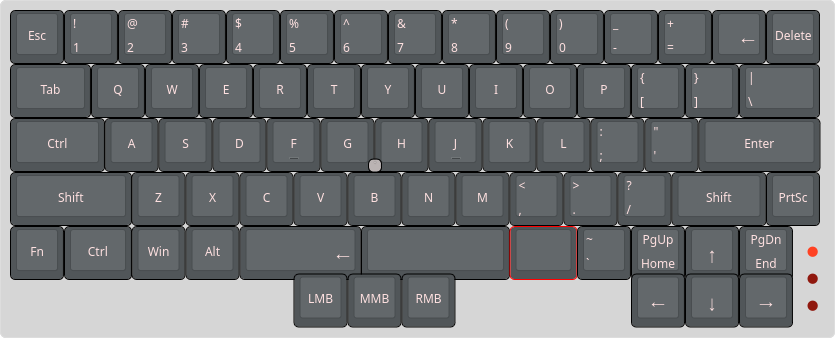

# Project Stardust

A custom keyboard created to mimick the layout of thinkpad's keyboard + some layout improvement (i guess).

**The layout :**

PCB for trackpoint module will come soon (hopefully...) + The application for directly configuring the keyboard

I will not procrastinate 
I will not procrastinate 
I will not procrastinate 
I will not procrastinate 
I will not procrastinate 
I will not procrastinate 

